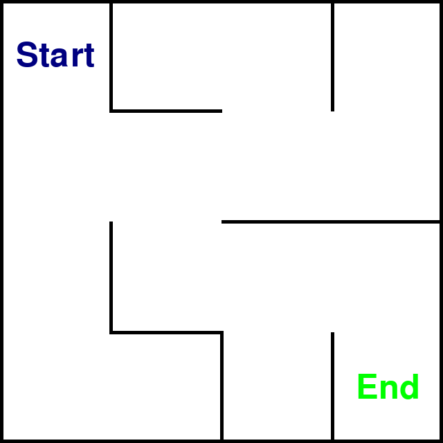

$${\Large\color{red}招募队友中，预计3-5人小队...}$$

  <a href="https://www.feishu.cn/invitation/page/add_contact/?token=db9m651e-10d4-4e68-aa61-5cf1c31c80f6&amp;unique_id=BAYMMa4KV21p9Ejnqf0Ebw==" target="_blank">请联系我 >>> 飞书</a>
   
<!--    -->
  

# MazeSolverLLM

> [Introduction Video](https://www.douyin.com/video/7350585864851950859)
> 
> [MIT NEWS MAGAZINE: Mighty mouse](https://www.technologyreview.com/2018/12/19/138508/mighty-mouse/)

迷宫问题 (Maze-Solving) 是一种经典的路径规划问题，它可以通过图论来解决。在这个问题中，迷宫被抽象为一个图（Graph），其中迷宫的每个地点被视为图中的一个节点，而两个相邻点之间的可行通道则对应于图的边。例如，4x4的地图可标记为16个节点，将所有可行路径作为连接节点的边，即构建了一张图（Graph）。通过这种方式，迷宫问题可以转化为最短路径问题（Shotest Path Problem, SPP），给定起始节点和目标节点，寻找图中最短路径。

- 基础：通过构建Graph纯文本数据的方式来训练和fine-tune LLM, 使其具备解谜能力。
- 进阶：通过直接输入迷宫图片, 使用多模态数据finetune LLM, 使其直接从迷宫的图像中提取信息。

    

## 任务划分

| **Task**                   	| **Detail**                                                                                                                           	| **Assignee** 	| **Note**                                                            	|
|----------------------------	|--------------------------------------------------------------------------------------------------------------------------------------	|--------------	|---------------------------------------------------------------------	|
|                            	| **_基础: MazeSolverLLM_**                                                                                                              	|              	|                                                                     	|
| Maze数据准备               	| 收集Maze数据，并整理成纯文本的instruction data形式。这包括定义迷宫的布局、起点和终点。                                               	|              	| 需要确保数据的多样性和质量。                                        	|
| Maze环境搭建               	| 根据Maze数据构建Gym Env，包括render可视化渲染。这将涉及到使用OpenAI Gym框架来创建一个可以模拟迷宫环境的强化学习环境。                	|              	| 环境需要能够准确地反映迷宫的布局，以及提供清晰的可视化界面。        	|
| LLM finetune               	| 对大型语言模型进行fine-tune，使其具备解决迷宫问题的能力。这包括训练模型的prompt设计，以及Chain-of-Thought的让LLM学会一些路径搜索算法 	|              	| 需要选择合适的预训练模型，并设计有效的fine-tune策略来适应迷宫问题。 	|
| LLM evaluation             	| 对fine-tuned的LLM进行评估，测试其在解决迷宫问题上的性能。这包括设置评估标准，分析结果，可视化展现。                                  	|              	| 评估应该全面，包括准确率、解决时间、对不同类型迷宫的适应性等指标。  	|
| LLM deploy                 	| 在线Web端（如openxlab）部署MazeSolverLLM，提供解谜实例或接受用户给出的迷宫题目。                                                     	|              	| 高效轻量级部署，同时具备对用户输入信息的准确识别和鲁棒性回复。      	|
| 文档编写                   	| 编写详细的项目文档和用户教程                                                                                                         	|              	|                                                                     	|
|                            	| **_进阶: Multimudal-MazeSolverLLM_**                                                                                                   	|              	|                                                                     	|
| 将Maze图片转化为Maze Graph 	| vision-language 多模态输入，LLM直接对图片进行建模分析求解                                                                            	|              	| 可能需要分为多个LLM，多模块，多阶段训练                             	|

## 特别鸣谢

Thanks in advance. 

<b>感谢上海人工智能实验室组织的 书生·浦语实战营 学习活动</b>

<b>感谢 OpenXLab 对项目开发的算力支持</b>

